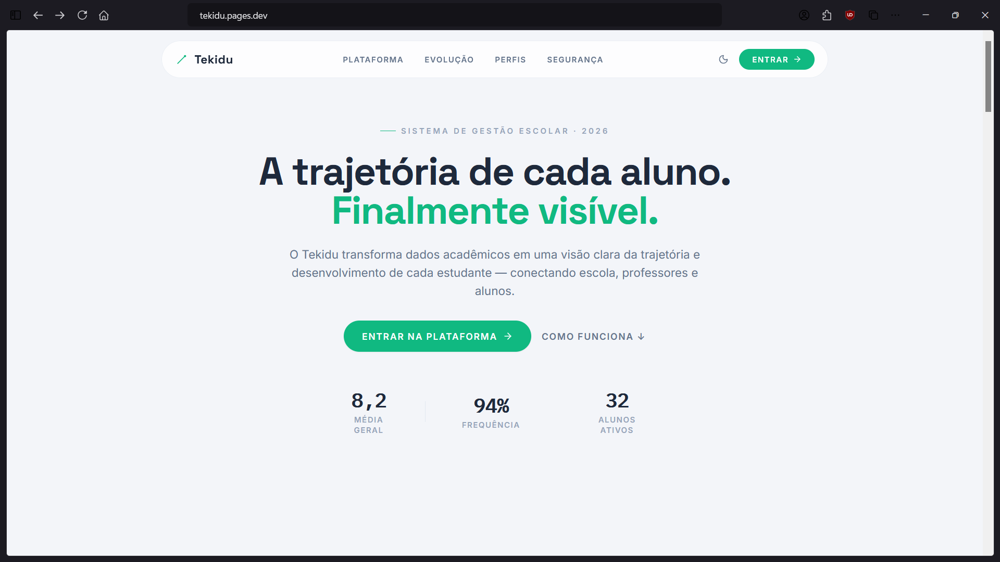
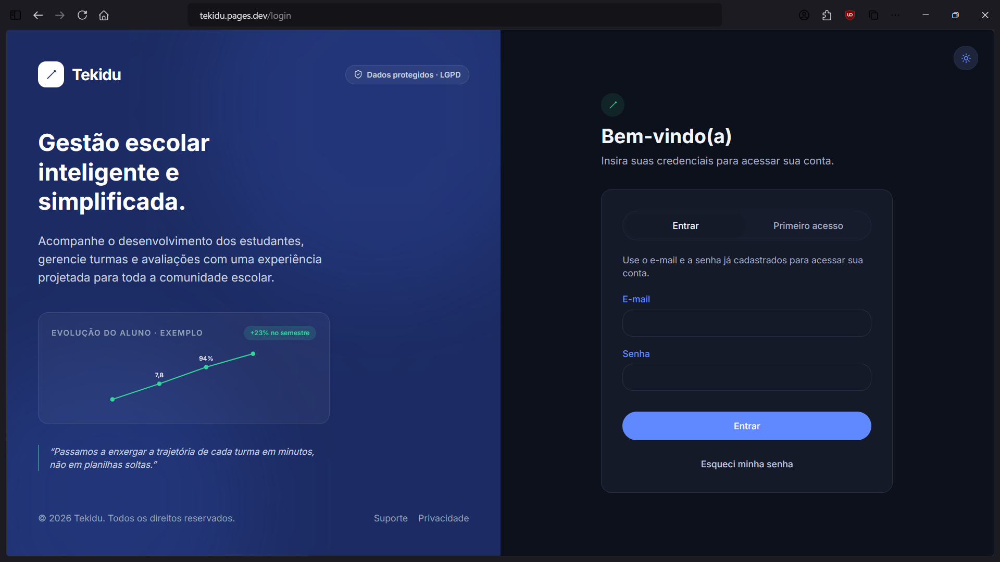
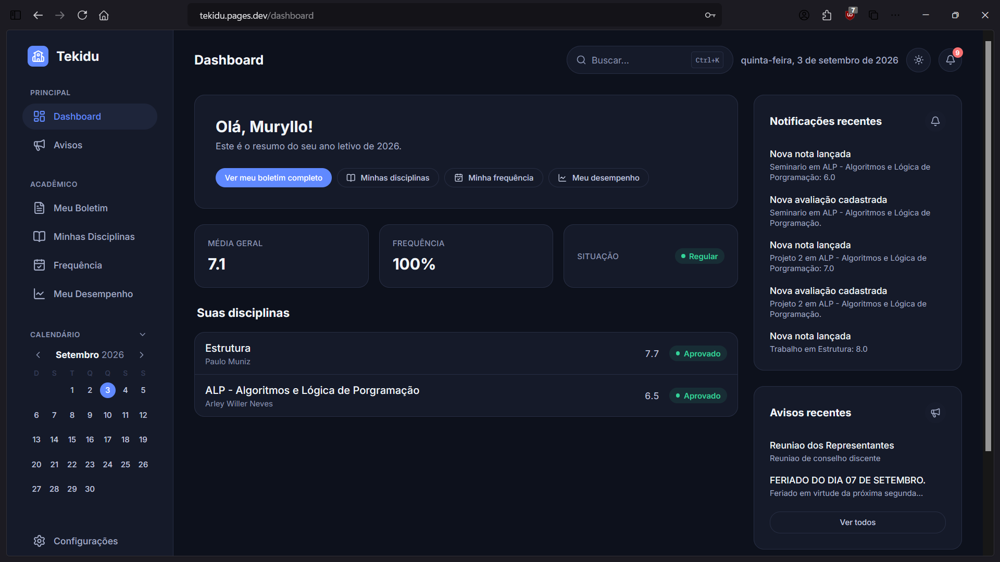
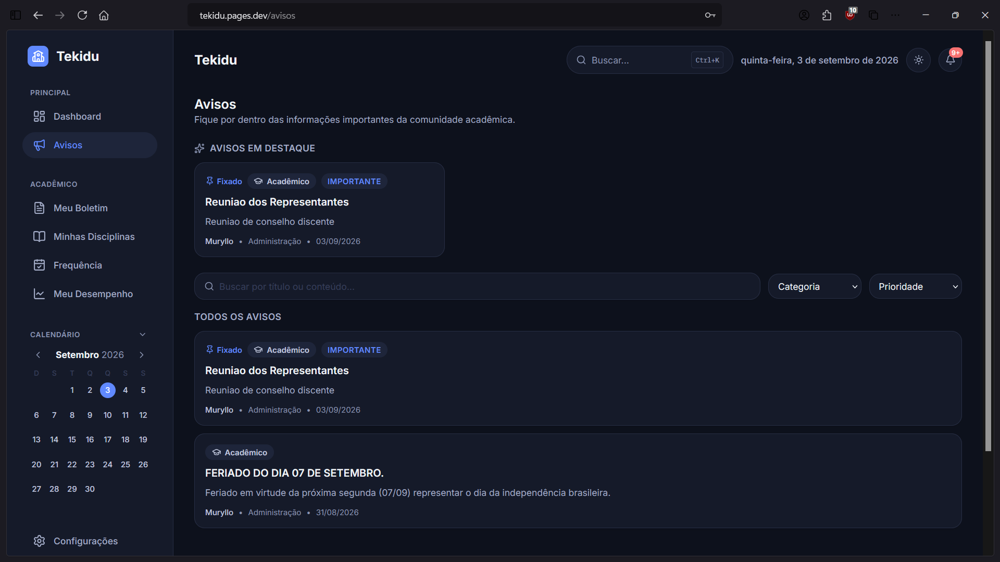
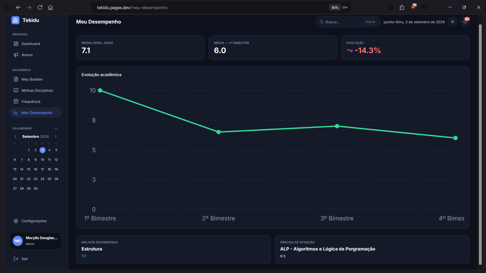

<div align="center">

# 🎓 Tekidu

### Visualizando a evolução acadêmica.

Plataforma de gestão e acompanhamento acadêmico com experiências dedicadas para **administradores, professores e estudantes**.

<br />


[](https://ifconnect.pages.dev)

<br />

<a href="#sobre">Sobre</a> • <a href="#principais-funcionalidades">Funcionalidades</a> • <a href="#capturas-de-tela">Capturas de tela</a> • <a href="#diferenciais-técnicos">Diferenciais</a> • <a href="#tecnologias">Tecnologias</a> • <a href="#instalação">Instalação</a> • <a href="https://ifconnect.pages.dev">Demo</a>

</div>

---

## Sobre

A **Tekidu** centraliza informações acadêmicas — notas, frequência, boletim, turmas e comunicados — em um único ambiente, no lugar de planilhas e sistemas dispersos.

A plataforma possui três experiências distintas, cada uma com permissões e telas próprias:

| Perfil | Foco |
|---|---|
| 👨‍💼 **Administrador** | Gestão de estudantes, professores, turmas, disciplinas e avisos |
| 👨‍🏫 **Professor** | Turmas, avaliações, lançamento de notas e frequência |
| 👨‍🎓 **Estudante** | Boletim, desempenho, frequência e avisos, com acesso restrito aos próprios dados |

---

## Principais funcionalidades

- **Autenticação completa** — login, primeiro acesso (com e-mail transacional via EmailJS) e recuperação de senha, tudo via Firebase Authentication.
- **Gestão acadêmica** — estudantes, professores, turmas, disciplinas e avaliações, com CRUDs completos para o perfil admin.
- **Notas e boletim** — lançamento de avaliações, cálculo de médias e boletim consolidado por estudante.
- **Frequência** — registro de sessões, presença/ausência e histórico por período.
- **Relatórios e desempenho** — indicadores acadêmicos por estudante e por turma.
- **Avisos, notificações e calendário acadêmico** — comunicação centralizada, com central de notificações dedicada.
- **Command Palette** — navegação rápida por atalhos de teclado.
- **UX mobile dedicada** — bottom navigation, sheets e FAB próprios para telas pequenas (não apenas CSS responsivo).
- **Dark mode** — tema claro/escuro via tokens de design em CSS variables.

---

## Capturas de tela

<div align="center">

| Landing Page | Login | Dashboard |
|---|---|---|
|  |  |  |

| Boletim | Avisos | Meu Desempenho |
|---|---|---|
|  |  |  |

</div>

---

## Diferenciais técnicos

### 🔐 Segurança no banco, não só na interface
As permissões por role (`admin`, `teacher`, `student`) são validadas diretamente em **Firestore Security Rules**, cobrindo quem pode ler/escrever cada coleção, validação de payload e acesso restrito a dados próprios — esconder um botão na UI não é tratado como controle de acesso.

### 🧪 Testes automatizados em duas frentes
As regras de segurança têm suíte própria com **Vitest + Firebase Emulator + `@firebase/rules-unit-testing`**, validando cenários de acesso permitido/negado. Há também testes de unidade para regras de negócio (cálculo de médias e frequência), fora do escopo das rules.

### ⚡ Code splitting granular
Praticamente todas as páginas são carregadas sob demanda com `React.lazy`, agrupadas por `<Suspense>` conforme o perfil do usuário — um estudante nunca baixa o código do portal administrativo.

### 🧩 Camada de serviços por domínio
A comunicação com o Firestore fica isolada em serviços (`students`, `grades`, `attendance`, `reports`, `audit`, `email`, entre outros), mantendo componentes de UI livres de lógica de acesso a dados.

### 📝 Auditoria de ações
Alterações sensíveis (como edição de notas) geram um log de auditoria assíncrono, sem bloquear a ação principal do usuário caso o registro falhe.

---

## Tecnologias

| Frontend | Interface | Backend & Dados | Testes |
|---|---|---|---|
| React 18 | Tailwind CSS | Firebase Authentication | Vitest |
| TypeScript | Framer Motion | Cloud Firestore | Firebase Emulator |
| Vite | Lucide React | Firestore Security Rules | `@firebase/rules-unit-testing` |
| React Router | | Cloudflare Pages Function (e-mail) | |

---

## Arquitetura

```text
UI (pages / components)
        ↓
Services (por domínio)
        ↓
Firebase (Auth + Firestore)
        ↓
Firestore Security Rules
```

```text
src/
├── components/   # UI reutilizável (inclui variantes mobile)
├── pages/        # Telas por perfil (admin, teacher, student)
├── services/     # Acesso a dados por domínio
├── contexts/     # Auth, tema, toasts
├── security/     # Testes das Firestore Rules
└── routes/       # Roteamento com guards por role
```

---

## Instalação

```bash
git clone https://github.com/muryllodouglashsoares/tekidu.git
cd tekidu
npm install
```

Configure o ambiente copiando `.env.example` para `.env.local` e preenchendo as credenciais do seu projeto Firebase:

```bash
cp .env.example .env.local
```

```bash
npm run dev
```

## Scripts

| Comando | Descrição |
|---|---|
| `npm run dev` | Ambiente de desenvolvimento |
| `npm run build` | Build de produção (`tsc -b && vite build`) |
| `npm run test` | Testes de unidade |
| `npm run test:rules` | Testes das Firestore Security Rules (via emulador) |
| `npm run lint` | ESLint |

---

## Roadmap

**Concluído**
- [x] Autenticação, primeiro acesso e recuperação de senha
- [x] Portais de admin, professor e estudante
- [x] Notas, frequência, boletim e relatórios
- [x] Avisos, notificações e calendário acadêmico
- [x] Command Palette e UX mobile dedicada
- [x] Firestore Security Rules + testes automatizados
- [x] Code splitting por perfil
- [x] Log de auditoria (básico)

**Próximas evoluções**
- [ ] Dashboard de auditoria mais completo
- [ ] Monitoramento de erros em produção
- [ ] CI/CD
- [ ] Testes de componentes de interface
- [ ] Melhorias de acessibilidade
- [ ] PWA

---

## Demonstração

🚀 **[Acesse a demonstração da Tekidu](https://ifconnect.pages.dev)**

---

## Desenvolvedor

<div align="center">

**Muryllo Douglas**
Desenvolvedor em formação, estudante de Informática.

[](https://github.com/muryllodouglashsoares)

<br />

⭐ Se este projeto te ajudou a entender o que eu construo, considere deixar uma estrela.

</div>
