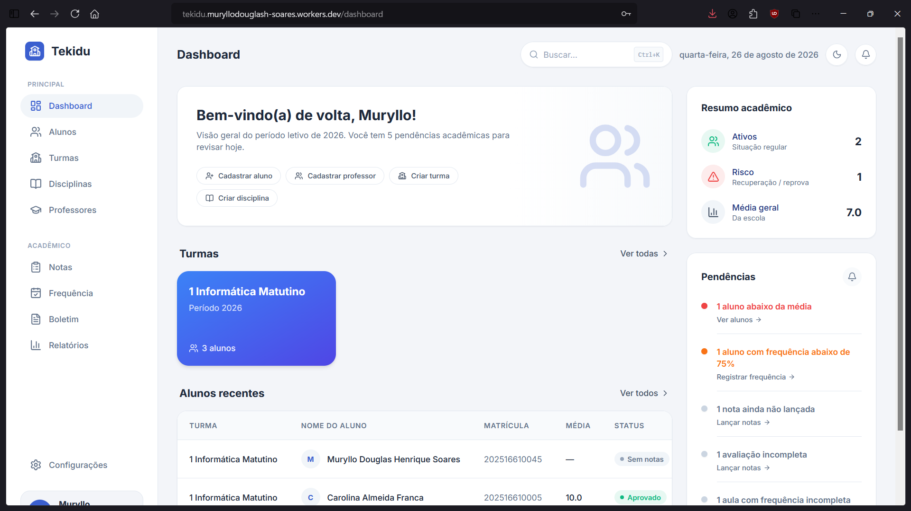

<div align="center">



<br />

# 🎓 Tekidu

### Visualizando a evolução acadêmica.

Uma plataforma de gestão e acompanhamento acadêmico desenvolvida para conectar **administração, professores e estudantes** em um único ambiente.

<br />


<br />

<a href="#-sobre-o-projeto">Sobre</a> • <a href="#-principais-funcionalidades">Funcionalidades</a> • <a href="#-arquitetura">Arquitetura</a> • <a href="#-segurança">Segurança</a> • <a href="#-tecnologias">Tecnologias</a> • <a href="#-instalação">Instalação</a>

</div>

---

# 📖 Sobre o projeto

A **Tekidu** é uma plataforma de gestão e acompanhamento acadêmico desenvolvida para centralizar informações escolares e tornar a evolução dos estudantes mais fácil de visualizar.

O projeto foi desenvolvido considerando diferentes usuários dentro de um ambiente educacional.

A plataforma possui experiências específicas para:

* 👨‍💼 Administradores;
* 👨‍🏫 Professores;
* 👨‍🎓 Estudantes.

Cada perfil possui funcionalidades e permissões próprias.

A proposta central da Tekidu pode ser resumida em uma pergunta:

> **Como transformar dados acadêmicos em informações que realmente ajudem a compreender a evolução de um estudante?**

---

# 🎯 O problema

Informações acadêmicas frequentemente estão distribuídas entre diferentes ferramentas, documentos e sistemas.

Isso pode dificultar:

* acompanhar o desempenho dos estudantes;
* visualizar notas e médias;
* registrar frequência;
* organizar turmas;
* administrar disciplinas;
* acompanhar o desempenho acadêmico;
* comunicar informações importantes;
* controlar quem pode acessar determinadas informações.

A Tekidu busca centralizar essas informações em uma única plataforma.

---

# 💡 A solução

A Tekidu organiza o ambiente acadêmico em três experiências principais.

```text
                     ┌──────────────┐
                     │    TEKIDU    │
                     └──────┬───────┘
                            │
            ┌───────────────┼───────────────┐
            │               │               │
            ▼               ▼               ▼
        ADMIN           PROFESSOR       ESTUDANTE
            │               │               │
            ▼               ▼               ▼
      Gestão escolar   Gestão acadêmica  Acompanhamento
```

Cada perfil possui acesso apenas às funcionalidades necessárias.

---

# ✨ Principais funcionalidades

## 👨‍💼 Portal Administrativo

O administrador possui acesso à gestão geral da plataforma.

### Funcionalidades

* 👥 Gerenciamento de estudantes;
* 👨‍🏫 Gerenciamento de professores;
* 🏫 Gerenciamento de turmas;
* 📚 Gerenciamento de disciplinas;
* 📝 Gerenciamento de informações acadêmicas;
* 📊 Visualização de dados gerais;
* 📢 Gerenciamento de avisos;
* 📅 Gerenciamento do calendário acadêmico;
* 🔐 Controle de usuários;
* ⚙️ Configurações da plataforma.

---

# 👨‍🏫 Portal do Professor

O professor possui uma experiência voltada para a gestão de suas atividades acadêmicas.

### Funcionalidades

* 📚 Visualização das próprias turmas;
* 👥 Visualização dos estudantes;
* 📝 Registro de notas;
* 📋 Gerenciamento de avaliações;
* 📅 Registro de frequência;
* 📊 Visualização de desempenho;
* 📈 Acompanhamento acadêmico.

---

# 👨‍🎓 Portal do Estudante

O estudante possui acesso às próprias informações acadêmicas.

### Funcionalidades

* 📊 Dashboard acadêmico;
* 📝 Visualização do boletim;
* 📚 Consulta de disciplinas;
* 📅 Acompanhamento de frequência;
* 📈 Visualização do desempenho;
* 🔔 Acesso a notificações;
* 📢 Consulta de avisos;
* 📅 Calendário acadêmico.

---

# 📝 Sistema de Notas

A Tekidu possui uma estrutura para gerenciamento de informações acadêmicas.

O sistema permite trabalhar com:

```text
Disciplina
    ↓
Avaliações
    ↓
Notas
    ↓
Médias
    ↓
Situação acadêmica
```

As avaliações podem possuir diferentes contextos dentro da disciplina.

O objetivo é permitir uma visão organizada do desempenho acadêmico.

---

# 📅 Controle de Frequência

A plataforma possui um sistema específico para registro e acompanhamento de frequência.

O sistema permite:

* registrar sessões de frequência;
* registrar presença;
* registrar ausência;
* visualizar histórico;
* consultar frequência por período;
* visualizar estatísticas.

O estudante possui acesso apenas às próprias informações.

---

# 📊 Boletim Acadêmico

O boletim reúne informações acadêmicas do estudante.

Entre as informações estão:

* disciplinas;
* avaliações;
* notas;
* médias;
* situação acadêmica.

A funcionalidade permite transformar registros acadêmicos em uma visualização organizada.

---

# 📈 Relatórios e Desempenho

A Tekidu possui uma área voltada para análise acadêmica.

Entre os recursos estão:

* indicadores acadêmicos;
* relatórios por estudante;
* relatórios por turma;
* visualização da evolução;
* gráficos de desempenho.

---

# 📢 Portal de Avisos

A plataforma possui um sistema de comunicação interna.

Os usuários podem consultar avisos relacionados ao ambiente acadêmico.

Os avisos podem possuir:

* categorias;
* prioridade;
* detalhes;
* informações específicas.

O acesso aos avisos também considera o perfil do usuário.

---

# 📅 Calendário Acadêmico

O calendário acadêmico centraliza eventos importantes.

Entre os possíveis eventos estão:

* avaliações;
* atividades;
* eventos acadêmicos;
* datas importantes;
* informações institucionais.

A funcionalidade está disponível dentro da experiência autenticada da plataforma.

---

# 🔔 Notificações

A Tekidu possui uma estrutura para centralização de notificações.

O objetivo é permitir que informações relevantes possam ser apresentadas ao usuário dentro da plataforma.

---

# 🔍 Command Palette

A aplicação possui uma **Command Palette** para facilitar a navegação.

Esse recurso permite acessar funcionalidades rapidamente através de comandos.

É uma funcionalidade inspirada em interfaces modernas de produtividade.

---

# 🔐 Autenticação

A autenticação é baseada no Firebase Authentication.

A plataforma possui:

* Login;
* Recuperação de senha;
* Primeiro acesso;
* Controle de contas ativas;
* Separação de usuários por perfil.

---

# 👥 Controle de Acesso por Roles

A Tekidu trabalha com diferentes níveis de acesso.

```text
ADMIN
│
├── Gestão de estudantes
├── Gestão de professores
├── Gestão de turmas
├── Gestão de disciplinas
└── Administração geral


TEACHER
│
├── Minhas turmas
├── Meus estudantes
├── Notas
├── Avaliações
└── Frequência


STUDENT
│
├── Meu boletim
├── Minhas disciplinas
├── Minha frequência
└── Meu desempenho
```

A interface não é a única camada responsável por controlar permissões.

---

# 🛡️ Segurança

A Tekidu utiliza **Firestore Security Rules** para proteger os dados diretamente no banco.

Isso significa que esconder uma funcionalidade da interface não é considerado uma medida suficiente de segurança.

As regras verificam permissões no servidor.

Exemplos de preocupações implementadas:

* estudantes acessam apenas os próprios dados;
* professores possuem acesso limitado às próprias disciplinas;
* administradores possuem permissões específicas;
* usuários desativados possuem acesso restrito;
* notas possuem validação;
* frequência possui validação;
* alterações possuem restrições de payload.

---

# 🧪 Testes de Segurança

As regras do Firestore possuem testes automatizados.

Tecnologias utilizadas:

* Vitest;
* Firebase Emulator;
* `@firebase/rules-unit-testing`.

O objetivo é validar que as permissões funcionem corretamente.

Exemplo conceitual:

```text
Student A
    │
    ├── Pode acessar → Dados próprios
    │
    └── Não pode acessar → Dados do Student B
```

Esse tipo de teste ajuda a evitar regressões de segurança durante o desenvolvimento.

---

# ⚡ Performance

A aplicação utiliza **Code Splitting** com React `lazy()`.

As páginas são carregadas de acordo com a necessidade do usuário.

Por exemplo:

```text
Aluno
   ↓
Não precisa baixar
   ↓
Portal Administrativo
Gestão de Professores
Gestão Geral de Turmas
```

Isso reduz o código carregado desnecessariamente.

A estratégia também considera diferentes grupos de usuários.

```text
Admin
Teacher
Student
```

Cada grupo possui páginas carregadas sob demanda.

---

# 🏗️ Arquitetura

A aplicação é organizada em camadas.

```text
src
│
├── components
│   ├── academic
│   ├── attendance
│   ├── announcements
│   ├── boletim
│   ├── calendar
│   ├── layout
│   ├── reports
│   └── ui
│
├── contexts
│   ├── AuthContext
│   ├── ThemeContext
│   └── ToastContext
│
├── hooks
│
├── pages
│   ├── auth
│   ├── dashboard
│   ├── students
│   ├── teachers
│   ├── classes
│   ├── studentPortal
│   └── teacherPortal
│
├── routes
│
├── services
│
├── security
│
└── types
```

---

# 🔄 Arquitetura de Serviços

A lógica de comunicação com o banco de dados é organizada através de serviços.

Exemplos:

```text
services/
│
├── students/
├── teachers/
├── classes/
├── disciplines/
├── grades/
├── attendance/
├── assessments/
├── boletim/
├── reports/
├── announcements/
├── notifications/
└── academicEvents/
```

Essa separação ajuda a evitar que a lógica de acesso aos dados fique diretamente acoplada aos componentes da interface.

---

# 🧠 Decisões Técnicas

## 🔥 Firebase

O Firebase foi utilizado para fornecer:

* autenticação;
* banco de dados;
* persistência;
* regras de segurança.

A escolha permitiu concentrar o desenvolvimento na aplicação sem a necessidade inicial de construir uma infraestrutura completa de backend.

---

## 🔐 Segurança além do Frontend

A Tekidu não depende apenas do React para controlar permissões.

As regras do Firestore verificam:

```text
Quem está realizando a operação?
        ↓
Qual é o perfil do usuário?
        ↓
O usuário está ativo?
        ↓
Ele possui permissão?
        ↓
O dado enviado é válido?
```

---

## ⚡ Code Splitting

Nem todos os usuários precisam baixar todas as funcionalidades.

Por isso, páginas específicas são carregadas sob demanda.

Isso melhora a eficiência do carregamento da aplicação.

---

## 🧩 Componentização

A interface é dividida em componentes reutilizáveis.

Exemplos:

* Cards;
* Modais;
* Inputs;
* Tabelas;
* Badges;
* Estados vazios;
* Estados de erro;
* Skeletons;
* Paginação;
* Filtros.

---

# 🎨 Experiência do Usuário

A interface possui componentes específicos para diferentes estados da aplicação.

### Loading

```text
Skeleton
Spinner
```

### Dados vazios

```text
EmptyState
```

### Erros

```text
ErrorState
```

### Feedback

```text
Toast
Confirm Dialog
```

Esses elementos ajudam a criar uma experiência mais completa do que simplesmente exibir dados em tela.

---

# 🛠️ Tecnologias

## Frontend

* React
* TypeScript
* React Router
* Vite

## Interface

* Tailwind CSS
* Lucide React
* Framer Motion

## Backend e Dados

* Firebase
* Firebase Authentication
* Cloud Firestore

## Testes

* Vitest
* Firebase Rules Unit Testing
* Firebase Emulator

---

# 📦 Principais Dependências

```text
react
react-router-dom
firebase
framer-motion
lucide-react
tailwindcss
vitest
```

---

# 🚀 Instalação

## Clone o repositório

```bash
git clone https://github.com/muryllodouglashsoares/tekidu.git
```

## Acesse o diretório

```bash
cd tekidu
```

## Instale as dependências

```bash
npm install
```

## Configure as variáveis de ambiente

Crie um arquivo:

```text
.env
```

Utilizando:

```text
.env.example
```

---

## Execute o projeto

```bash
npm run dev
```

---

# 🧪 Testes

Execute os testes:

```bash
npm run test
```

Para executar os testes das regras de segurança:

```bash
npm run test:rules
```

---

# 🏗️ Build

Para gerar uma build de produção:

```bash
npm run build
```

Para visualizar a build:

```bash
npm run preview
```

---

# 📜 Scripts

| Comando              | Função                                |
| -------------------- | ------------------------------------- |
| `npm run dev`        | Executa o ambiente de desenvolvimento |
| `npm run build`      | Gera a build de produção              |
| `npm run preview`    | Visualiza a build                     |
| `npm run lint`       | Executa o ESLint                      |
| `npm run test`       | Executa os testes                     |
| `npm run test:rules` | Testa as Firestore Security Rules     |

---

# 📈 Roadmap

## Plataforma

* [x] Landing Page
* [x] Autenticação
* [x] Primeiro acesso
* [x] Recuperação de senha
* [x] Portal Administrativo
* [x] Portal do Professor
* [x] Portal do Estudante
* [x] Gestão de estudantes
* [x] Gestão de professores
* [x] Gestão de turmas
* [x] Gestão de disciplinas
* [x] Sistema de notas
* [x] Avaliações
* [x] Controle de frequência
* [x] Boletim
* [x] Calendário acadêmico
* [x] Portal de avisos
* [x] Relatórios
* [x] Notificações
* [x] Controle de acesso por roles
* [x] Firestore Security Rules
* [x] Testes de segurança
* [x] Code Splitting

## Próximas evoluções

* [ ] Melhorar auditoria de ações;
* [ ] Monitoramento de erros;
* [ ] CI/CD;
* [ ] Melhorias de acessibilidade;
* [ ] Testes adicionais de interface;
* [ ] Melhorias de performance;
* [ ] PWA;
* [ ] Dashboard administrativo com análises mais avançadas.

---

# 🎯 Destaques Técnicos

A Tekidu foi desenvolvida buscando resolver desafios que aparecem em aplicações reais.

Entre eles:

* 🔐 Autenticação;
* 👥 Múltiplos tipos de usuários;
* 🛡️ Controle de permissões;
* 🔥 Segurança no banco de dados;
* 🧪 Testes automatizados;
* 📊 Modelagem de dados acadêmicos;
* ⚡ Otimização de carregamento;
* 🧩 Componentização;
* 📱 Experiência responsiva;
* 📈 Visualização de dados.

---

# 🧠 O que aprendi com este projeto

A Tekidu é um dos projetos mais completos desenvolvidos para o meu portfólio.

Durante o desenvolvimento, estou aprofundando conhecimentos em:

* Arquitetura Frontend;
* React;
* TypeScript;
* Firebase;
* Autenticação;
* Controle de acesso;
* Segurança de banco de dados;
* Firestore Security Rules;
* Testes;
* Modelagem de dados;
* Performance;
* Code Splitting;
* Design de interfaces;
* Experiência do usuário.

---

# 🔮 Visão

A Tekidu não foi pensada apenas como uma coleção de telas.

O objetivo é construir uma aplicação onde:

```text
Dados
   ↓
Informações
   ↓
Visualização
   ↓
Compreensão
   ↓
Evolução
```

A proposta central continua sendo:

> **Visualizar a evolução acadêmica e transformar informações escolares em uma experiência mais clara e acessível.**

---

# 🌐 Demonstração

🚀 **Acesse a demonstração:**

<!-- Adicione o link da aplicação aqui -->

```text
Em breve
```

---

# 👨‍💻 Desenvolvedor

<div align="center">

## Muryllo Douglas

Desenvolvedor em formação e estudante de Informática.

Tenho interesse no desenvolvimento de aplicações e sistemas que utilizem tecnologia para resolver problemas reais.

<br />

<a href="https://github.com/muryllodouglashsoares">


</a>

</div>

---

<div align="center">

### ⭐ Gostou do projeto?

Considere deixar uma estrela no repositório.

<br />

# 🎓 Tekidu

### Visualizando a evolução acadêmica.

</div>
